# Screenshots

Captured from the running application (full-page renders — desktop **1440px** wide,
mobile **390px** wide). These are live renders of the actual UI — the lobby, all eight
games, the Lucky Wheel, and the operator admin panel — not mockups.

> Balances/jackpots read **$0 / $1,000 demo** because these were shot against a fresh
> throwaway database seeded with a single demo player.

## Lobby & player UI

### Lobby
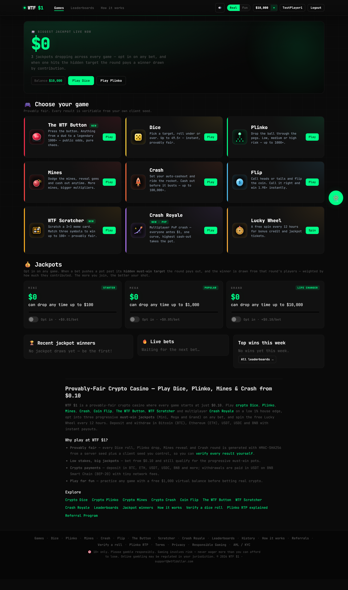

### Lobby (mobile)
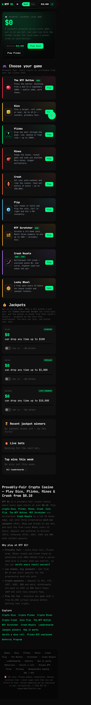

## Games

### The WTF Button — flagship mystery-multiplier game
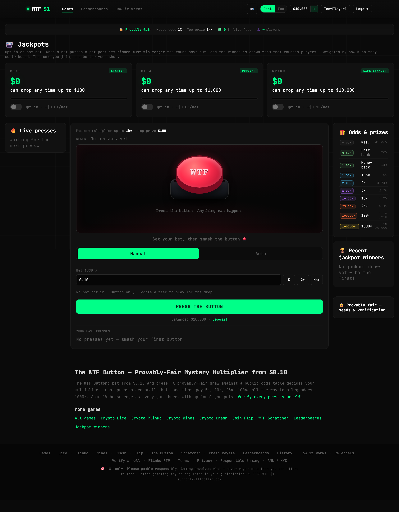

### Dice
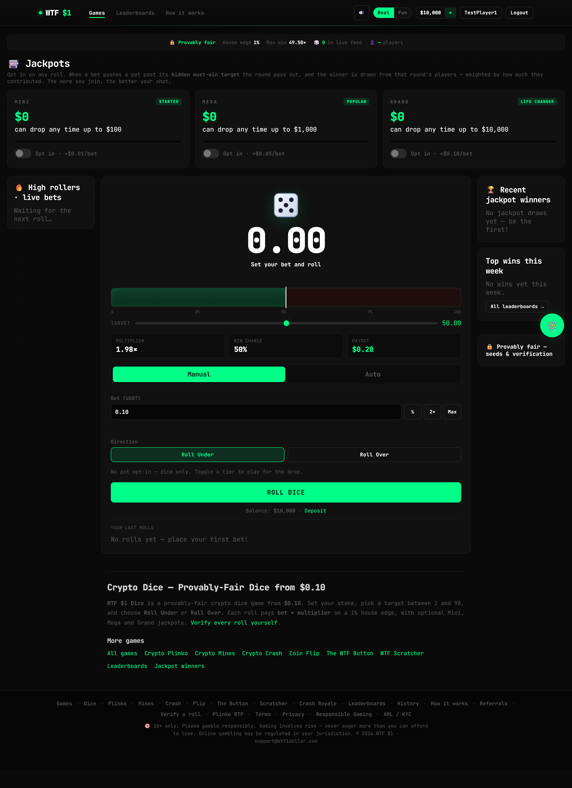

### Plinko
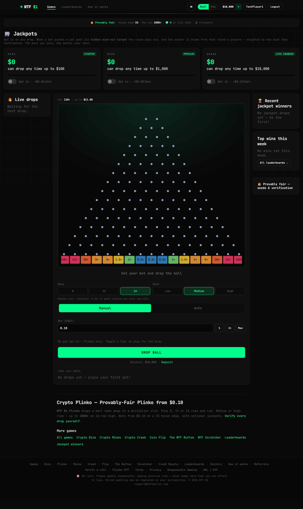

### Mines
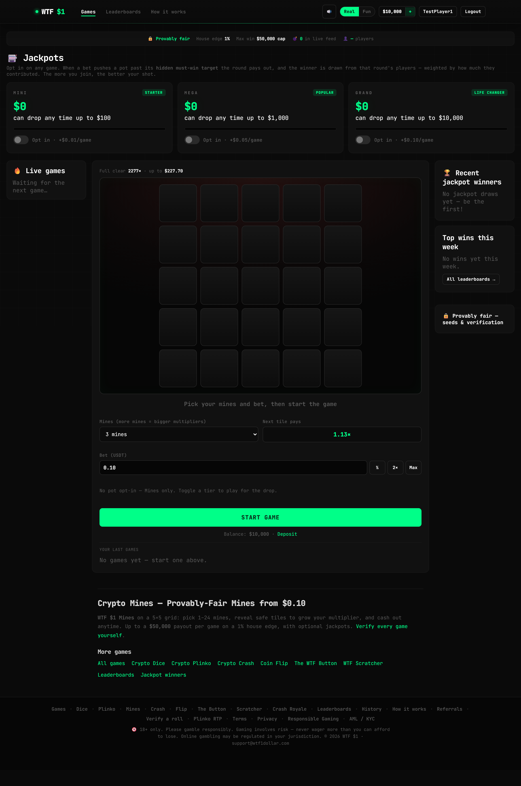

### Crash
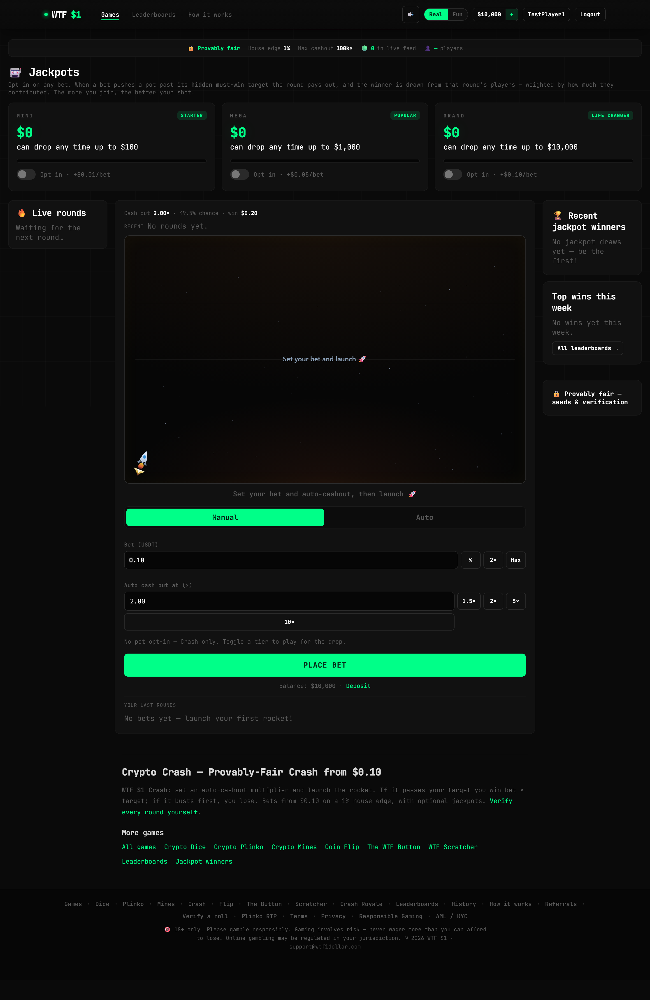

### Coin Flip
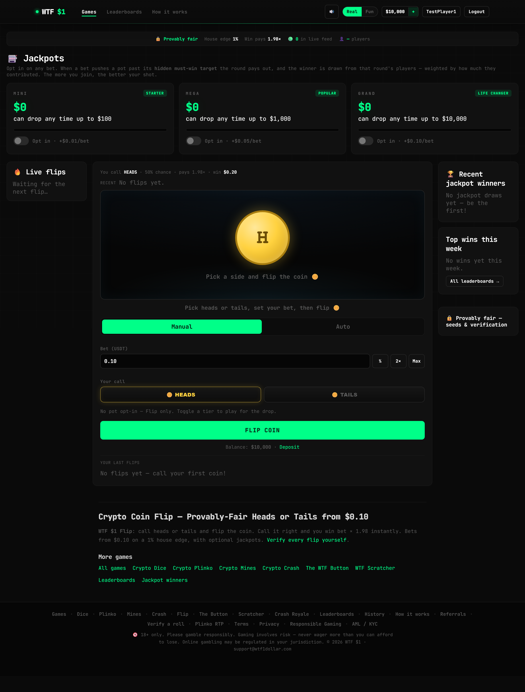

### WTF Scratcher
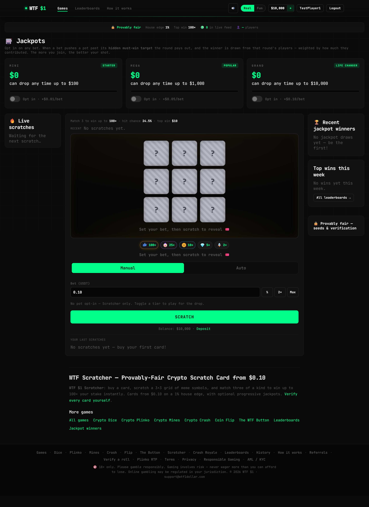

### Crash Royale — multiplayer PvP crash
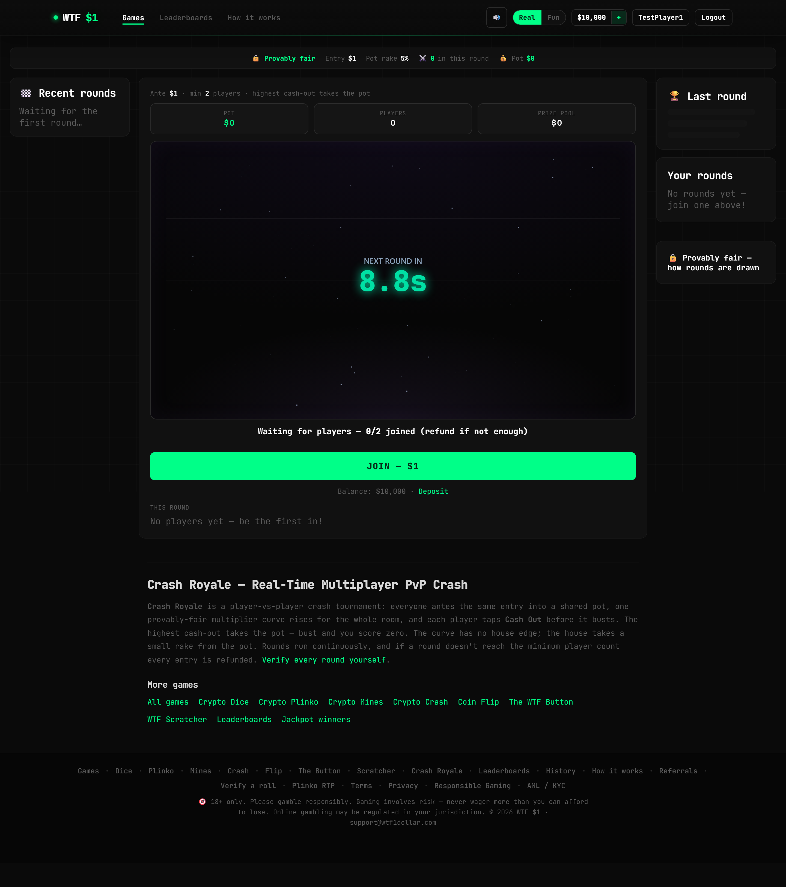

## Wallet & extras

### Wallet
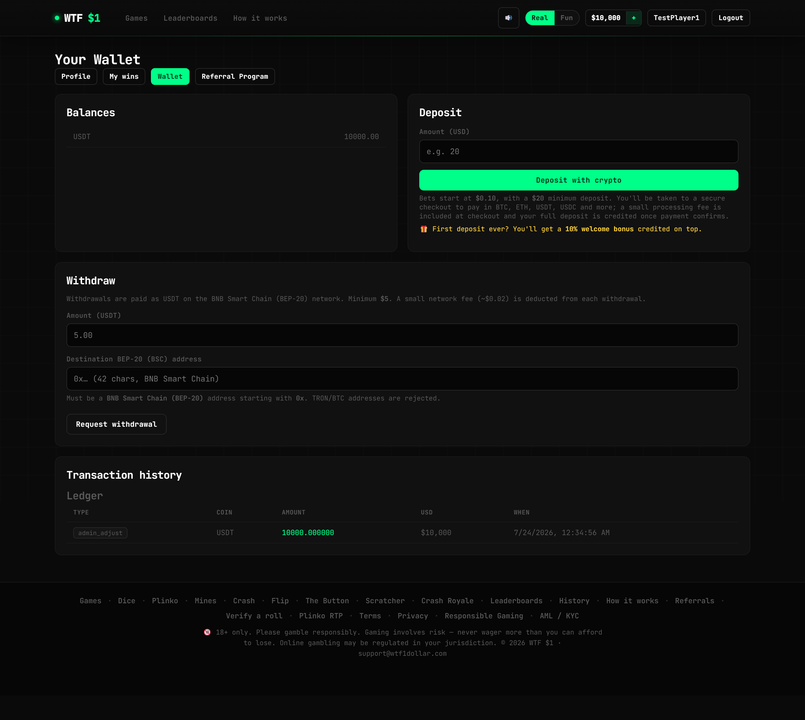

### Lucky Wheel
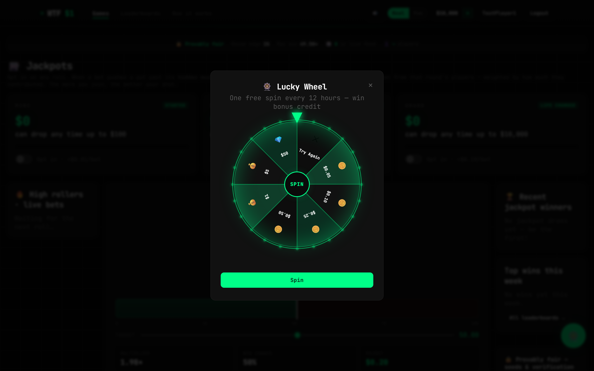

### How it works
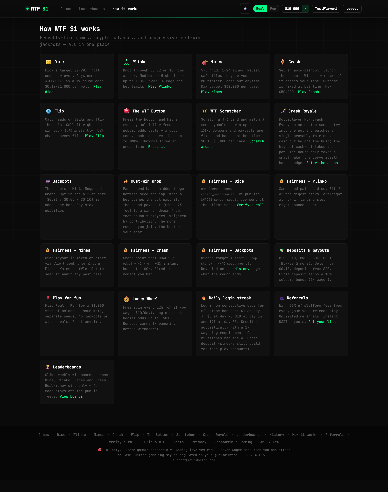

## Operator admin panel

### Dashboard
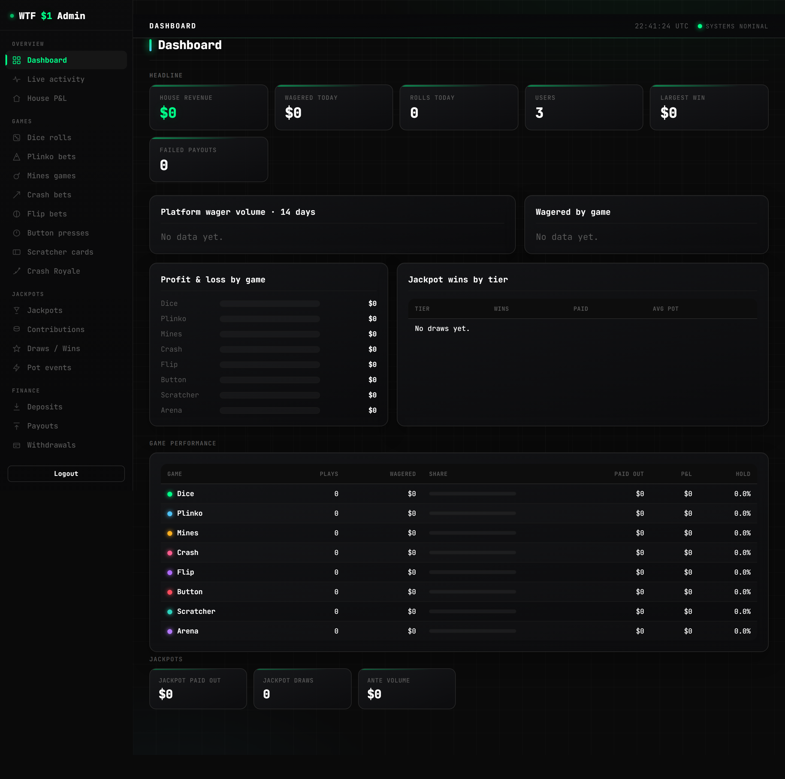

### Live activity
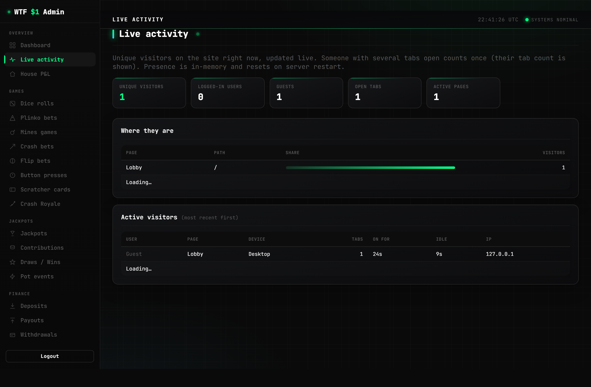
